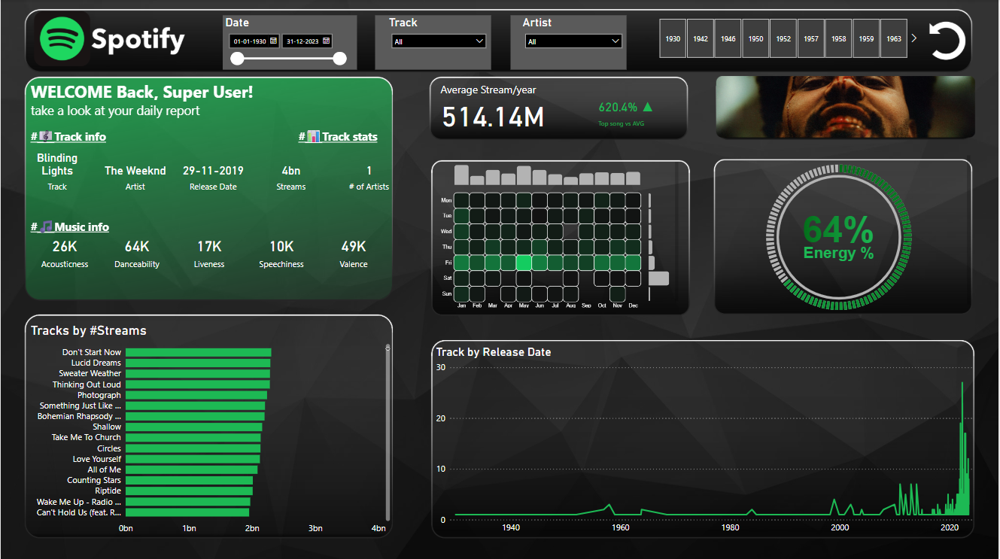

# 🎧 Spotify 2023 Power BI Dashboard



This project features an interactive Power BI dashboard visualizing the most streamed songs on Spotify in 2023. It blends custom visuals, enriched metadata, and a modern glassmorphism aesthetic to deliver powerful musical insights using **Deneb** and **HTML visuals**. **Inspired from youtube videos**

---

## Project Overview

This repository showcases the full data-to-dashboard pipeline:
- Raw data sourced from Kaggle  
- Enrichment using Spotify’s API to fetch album cover images  
- Visual storytelling in Power BI using HTML, Deneb, and a glassmorphism background  

---

## Repository Contents

| File Name                    | Description                                                                 |
|-----------------------------|-----------------------------------------------------------------------------|
| `spotify-2023.csv`          | Original dataset downloaded from Kaggle with 2023 top streamed songs        |
| `spotify_api_merge.py`      | Python script that uses Spotify API to retrieve album covers and merge them |
| `spotify_2023_with_covers.csv` | Final enriched dataset with cover URLs added via the Spotify API             |
| `Spotify_2023_Project.pbix` | Power BI dashboard using enriched data and custom visuals (Deneb + HTML)    |
| `Background.png`            | Glassmorphism background image designed in PowerPoint for Power BI design   |
| `preview.png`               | Screenshot preview of the Power BI dashboard                   |

---
> **Interested in the custom HTML or Deneb code used in this dashboard?**  
> Feel free to reach out — I'm happy to share it upon request.


## Data Enrichment Process

1. **Original Source**:  
   Downloaded from [Kaggle](https://www.kaggle.com/), containing audio features, streams, and metadata for 600+ top tracks.

2. **Spotify API Integration**:
   - Used `spotipy` and Python to authenticate with Spotify (Client ID/Secret).
   - Queried track + artist combinations to retrieve album art (`cover_url`).
   - Merged into the original dataset using `pandas`.

3. **Final Output**:
   - Saved as `spotify_2023_with_covers.csv` for visualization in Power BI.

---

## Dashboard Features

- **Glassmorphism UI**: Clean, modern interface with a transparent card effect  
- **Custom Visuals**: 
  - **Deneb** (Vega-Lite) for declarative charting
  - **HTML visual** for displaying album cover images and stylized elements  
- **Interactive Filters**: Explore by genre, artist, danceability, energy, etc.  
- **Insight Cards**: Highlights top artists, most streamed songs, and more  

---

## Tools & Technologies

- Python (`spotipy`, `pandas`)  
- Power BI Desktop  
- Spotify Web API  
- Deneb (Vega-Lite JSON-based visuals in Power BI)  
- HTML Viewer visual (custom HTML rendering in Power BI)  
- PowerPoint (for glassmorphism background design)  

---

## How to Use

1. **Clone the repository**:
   ```bash
   git clone https://github.com/Divyadharshini-Saravanakumar/spotify-dashboard.git

2. **Open in Power BI Desktop**:

Open the file:
Spotify_2023_Project.pbix 

3. **Load the dataset**:

Ensure the file spotify_2023_with_covers.csv is in the same folder as the .pbix file.

If the path is different, follow these steps in Power BI:

Go to Home → Transform Data → Data Source Settings

Click Change Source and update the file path

4. **Use your own Spotify API credentials**:

Open spotify_api_merge.py in any code editor

Replace the placeholders with your actual Spotify Client ID and Client Secret

5. **Run the script to regenerate your enriched dataset**:

Execute the script to fetch album cover URLs via Spotify API

The script will generate a new version of spotify_2023_with_covers.csv

Re-load it in Power BI if you make changes
